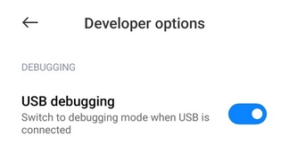

## Android Package Manager
**APM** is a simple application for uninstalling packages from android devices, that can't be uninstalled from the device itself. **APM** doesn't require root and uses official **ADB** means.

## How to Use
1. Enable developer options on your device in the **Developer options** menu  

1. Enable **USB debugging**  

1. Connect device to your PC
1. When **APM** runs for the first time, the device will ask you to **Allow USB debugging?** Press OK